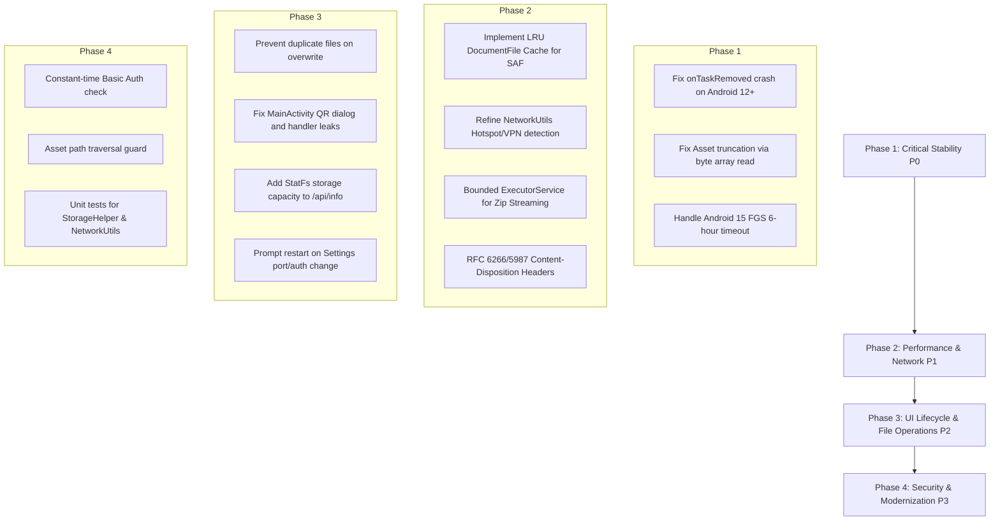

# PouchStream — Android Code Review, Bugfixes & Improvements

This document provides an in-depth code audit and architectural review of the native Android application source code for **PouchStream** (`com.asdk.media.pouchstream`), targeting SDK 37 (Android 15/16) and Min SDK 23 (Android 6.0).

Issues and recommendations are categorized and ordered by priority:
- **Priority 0 (P0) — Critical:** Immediate crashes, platform policy violations, data corruption, and broken core asset delivery.
- **Priority 1 (P1) — High:** Performance bottlenecks in media streaming, network resolution errors on Hotspot/VPN, concurrency risks, and background reliability.
- **Priority 2 (P2) — Medium:** UI lifecycle leaks, settings-to-runtime synchronization, storage space management, and file system quirks.
- **Priority 3 (P3) — Low / Architectural:** Security hardening, testing coverage, Kotlin migration, and modern architectural patterns.

---

## 📑 Summary of Findings

| ID | Category | Priority | Component / File | Issue Summary |
| :--- | :--- | :---: | :--- | :--- |
| **BUG-01** | Stability / Crash | **P0** | [`ServerService.java`](file:///c:/Users/User/AndroidStudioProjects/PouchStream/app/src/main/java/com/asdk/media/pouchstream/ServerService.java#L111-L125) | `ForegroundServiceStartNotAllowedException` crash on Android 12+ in `onTaskRemoved()`. |
| **BUG-02** | Core Asset Delivery | **P0** | [`PouchServer.java`](file:///c:/Users/User/AndroidStudioProjects/PouchStream/app/src/main/java/com/asdk/media/pouchstream/PouchServer.java#L644-L649) | `AssetInputStream.available()` truncates compressed web assets (> 1KB) causing corrupted frontend loads. |
| **BUG-03** | Platform Policy | **P0** | [`ServerService.java`](file:///c:/Users/User/AndroidStudioProjects/PouchStream/app/src/main/java/com/asdk/media/pouchstream/ServerService.java#L227-L232) / [`AndroidManifest.xml`](file:///c:/Users/User/AndroidStudioProjects/PouchStream/app/src/main/AndroidManifest.xml#L51) | Android 15 hard 6-hour execution timeout on `dataSync` foreground service type. |
| **PERF-01** | Performance / I/O | **P1** | [`StorageHelper.java`](file:///c:/Users/User/AndroidStudioProjects/PouchStream/app/src/main/java/com/asdk/media/pouchstream/StorageHelper.java#L87-L121) | Repeated sequential SAF ContentProvider IPC traversal on every HTTP 206 video range request. |
| **NET-01** | Networking | **P1** | [`NetworkUtils.java`](file:///c:/Users/User/AndroidStudioProjects/PouchStream/app/src/main/java/com/asdk/media/pouchstream/NetworkUtils.java#L18-L52) | IP address resolver falls back to carrier cellular IP (`rmnet`) or VPN (`tun0`) instead of LAN/Hotspot. |
| **NET-02** | Networking | **P1** | [`NetworkUtils.java`](file:///c:/Users/User/AndroidStudioProjects/PouchStream/app/src/main/java/com/asdk/media/pouchstream/NetworkUtils.java#L54-L68) | `isConnectedToNetwork()` reports `false` on offline Wi-Fi Hotspots without mobile data. |
| **CONC-01** | Concurrency / Stability | **P1** | [`PouchServer.java`](file:///c:/Users/User/AndroidStudioProjects/PouchStream/app/src/main/java/com/asdk/media/pouchstream/PouchServer.java#L429-L471) | Unmanaged thread spawning per `/api/zip` request leads to thread exhaustion and OOM. |
| **SEC-01** | Security / Headers | **P1** | [`PouchServer.java`](file:///c:/Users/User/AndroidStudioProjects/PouchStream/app/src/main/java/com/asdk/media/pouchstream/PouchServer.java#L613) | Missing RFC 6266 / RFC 5987 filename sanitization causes HTTP header injection or broken Unicode downloads. |
| **FS-01** | File System | **P2** [x] | [`StorageHelper.java`](file:///c:/Users/User/AndroidStudioProjects/PouchStream/app/src/main/java/com/asdk/media/pouchstream/StorageHelper.java#L320-L328) | Overwriting uploaded files creates numbered duplicates (`file (1).ext`) due to asynchronous SAF deletion. *(Resolved)* |
| **UI-01** | Lifecycle / Leak | **P2** [x] | [`MainActivity.java`](file:///c:/Users/User/AndroidStudioProjects/PouchStream/app/src/main/java/com/asdk/media/pouchstream/MainActivity.java#L353-L390) | QR Code generator thread and postDelayed callbacks leak activity context on screen rotation / back press. *(Resolved)* |
| **SET-01** | UX / Consistency | **P2** [x] | [`SettingsActivity.java`](file:///c:/Users/User/AndroidStudioProjects/PouchStream/app/src/main/java/com/asdk/media/pouchstream/SettingsActivity.java#L491-L495) | Port / Auth changes in settings do not update or prompt to restart an active running server. *(Resolved)* |
| **FEAT-01** | Feature Addition | **P2** [x] | [`StorageHelper.java`](file:///c:/Users/User/AndroidStudioProjects/PouchStream/app/src/main/java/com/asdk/media/pouchstream/StorageHelper.java) / [`PouchServer.java`](file:///c:/Users/User/AndroidStudioProjects/PouchStream/app/src/main/java/com/asdk/media/pouchstream/PouchServer.java#L127-L161) | Missing storage quota metric (`StatFs` free/total/used bytes) in `/api/info` and UI. *(Resolved)* |
| **SEC-02** | Security | **P3** | [`PouchServer.java`](file:///c:/Users/User/AndroidStudioProjects/PouchStream/app/src/main/java/com/asdk/media/pouchstream/PouchServer.java#L61) | String equality on HTTP Basic Auth credentials vulnerable to side-channel timing attacks. |
| **SEC-03** | Security | **P3** | [`PouchServer.java`](file:///c:/Users/User/AndroidStudioProjects/PouchStream/app/src/main/java/com/asdk/media/pouchstream/PouchServer.java#L635-L644) | Asset path canonicalization missing in `handleStaticAssets()` for `..` segments. |
| **ARCH-01** | Architecture | **P3** | Global | Static listeners in `ServerService` and `AppLogger` should migrate to Android Jetpack (`StateFlow` / `LiveData`). |

---

## 1. Priority 0 (P0) — Critical Stability & Platform Issues

### 1.1 Fatal Crash on Android 12+ via `onTaskRemoved()`
- **Location:** [`app/src/main/java/com/asdk/media/pouchstream/ServerService.java:111-125`](file:///c:/Users/User/AndroidStudioProjects/PouchStream/app/src/main/java/com/asdk/media/pouchstream/ServerService.java#L111-L125)
- **Root Cause:**
  When a user clears PouchStream from the Recent Apps list, `onTaskRemoved(Intent rootIntent)` is invoked. In the current implementation:
  ```java
  if (running) {
      Intent restartIntent = new Intent(getApplicationContext(), ServerService.class);
      restartIntent.setAction(ACTION_START);
      if (Build.VERSION.SDK_INT >= Build.VERSION_CODES.O) {
          startForegroundService(restartIntent);
      } else {
          startService(restartIntent);
      }
  }
  ```
  Starting in Android 12 (API 31), apps are forbidden from starting foreground services from the background, throwing `android.app.ForegroundServiceStartNotAllowedException`. Swiping the app away places the process in a cached/background state, so invoking `startForegroundService()` triggers an immediate crash.
- **Impact:** Immediate app crash when the user clears recents while the server is running.
- **Solution:**
  Remove the manual call to `startForegroundService()`. `ServerService` is already launched with `START_STICKY`, so the Android operating system will automatically restart the service when resources are available. If retained for legacy Android versions, wrap with defensive checks:
  ```java
  @Override
  public void onTaskRemoved(Intent rootIntent) {
      if (running && Build.VERSION.SDK_INT < Build.VERSION_CODES.S) {
          try {
              Intent restartIntent = new Intent(getApplicationContext(), ServerService.class);
              restartIntent.setAction(ACTION_START);
              startService(restartIntent);
          } catch (Exception e) {
              AppLogger.log("ServerService", "Could not restart on task removed: " + e.getMessage());
          }
      }
      super.onTaskRemoved(rootIntent);
  }
  ```

---

### 1.2 Web Asset Truncation Bug via `AssetInputStream.available()`
- **Location:** [`app/src/main/java/com/asdk/media/pouchstream/PouchServer.java:644-649`](file:///c:/Users/User/AndroidStudioProjects/PouchStream/app/src/main/java/com/asdk/media/pouchstream/PouchServer.java#L644-L649)
- **Root Cause:**
  In `handleStaticAssets()`:
  ```java
  InputStream is = context.getAssets().open("web/" + assetPath);
  String mime = StorageHelper.getMimeType(assetPath, "application/octet-stream");
  int available = is.available();
  return newFixedLengthResponse(Response.Status.OK, mime, is, available);
  ```
  According to Android SDK documentation, `AssetInputStream.available()` returns the number of bytes that can be read without blocking. For files compressed by `aapt`/`aapt2` inside the APK (such as `bootstrap.bundle.min.js`, `portal.css`, `uikit.min.js`), `is.available()` returns only the first chunk or an estimate (often 1024 or 4096 bytes), **not** the uncompressed file size.
  NanoHTTPD's `newFixedLengthResponse(..., available)` sets `Content-Length: available` and terminates the stream after reading only `available` bytes.
- **Impact:** CSS stylesheets, JavaScript files, and fonts are cut off halfway. The web portal fails to render properly or throws JavaScript syntax errors (`Unexpected end of input`).
- **Solution:**
  Read the asset completely into a byte array (or use `ByteArrayInputStream` with exact length), or use an in-memory cache for static web assets:
  ```java
  try (InputStream is = context.getAssets().open("web/" + assetPath);
       ByteArrayOutputStream baos = new ByteArrayOutputStream()) {
      byte[] buffer = new byte[8192];
      int read;
      while ((read = is.read(buffer)) != -1) {
          baos.write(buffer, 0, read);
      }
      byte[] bytes = baos.toByteArray();
      return newFixedLengthResponse(Response.Status.OK, mime, new ByteArrayInputStream(bytes), bytes.length);
  }
  ```

---

### 1.3 Android 15 (Target SDK 37) 6-Hour Timeout on `dataSync` Foreground Services
- **Location:**
  - [`app/src/main/AndroidManifest.xml:51`](file:///c:/Users/User/AndroidStudioProjects/PouchStream/app/src/main/AndroidManifest.xml#L51)
  - [`app/src/main/java/com/asdk/media/pouchstream/ServerService.java:229`](file:///c:/Users/User/AndroidStudioProjects/PouchStream/app/src/main/java/com/asdk/media/pouchstream/ServerService.java#L229)
- **Root Cause:**
  In Android 15 (API 35, targeted by SDK 37), the `dataSync` foreground service type has an enforced 6-hour runtime execution limit. If a foreground service with `foregroundServiceType="dataSync"` runs continuously for 6 hours, Android invokes `Service.onTimeout(int, int)` and forces the service to stop. If the app fails to stop, it crashes with `TimeoutCancellationException`.
- **Impact:** Long-running home media server or continuous overnight transfer sessions will be terminated by the OS after 6 hours on Android 15+ devices.
- **Solution:**
  1. Implement `onTimeout(int startId, int fgsType)` in `ServerService` to cleanly handle timeout notifications rather than crashing:
     ```java
     @Override
     public void onTimeout(int startId, int fgsType) {
         AppLogger.log("ServerService", "Service reached 6-hour execution timeout limit (FGS dataSync)");
         stopServer();
         stopSelf();
     }
     ```
  2. For distribution, document the local server use-case or evaluate migrating to `specialUse` with user justification if eligible under Google Play policy.

---

## 2. Priority 1 (P1) — High Performance & Core Reliability

### 2.1 Storage Access Framework (SAF) IPC Bottleneck in Media Streaming
- **Location:** [`app/src/main/java/com/asdk/media/pouchstream/StorageHelper.java:87-121`](file:///c:/Users/User/AndroidStudioProjects/PouchStream/app/src/main/java/com/asdk/media/pouchstream/StorageHelper.java#L87-L121)
- **Root Cause:**
  When streaming video files, HTML5 video players issue frequent HTTP 206 Partial Content range requests (often 100+ requests per minute for seeking and buffering 128KB-1MB blocks).
  In `PouchServer.handleStream(session)`:
  ```java
  DocumentFile doc = storageHelper.findByRelativePath(path);
  ```
  `findByRelativePath` traverses each path segment (`folder/subfolder/video.mp4`) starting from `rootDoc` using `current.findFile(part)` or iterating `current.listFiles()`. In Android SAF, every `findFile()` and `listFiles()` call issues a synchronous Binder IPC query to the external `DocumentsProvider`.
- **Impact:** Extreme latency on HTTP range responses (50ms - 300ms per chunk), video stuttering, high CPU usage, and battery consumption.
- **Solution:**
  Implement an in-memory thread-safe LRU cache (`LruCache<String, DocumentFile>`) or cached path-to-URI map in `StorageHelper`. Invalidate cache entries upon file upload, rename, or deletion:
  ```java
  private final android.util.LruCache<String, DocumentFile> docCache = new android.util.LruCache<>(256);

  public DocumentFile findByRelativePath(String relativePath) {
      if (rootDoc == null) return null;
      String clean = normalizeRelativePath(relativePath);
      if (clean.isEmpty()) return rootDoc;

      synchronized (docCache) {
          DocumentFile cached = docCache.get(clean);
          if (cached != null && cached.exists()) {
              return cached;
          }
      }
      // ... resolve segments ...
      synchronized (docCache) {
          docCache.put(clean, current);
      }
      return current;
  }
  ```

---

### 2.2 IP Resolution on Hotspot, Cellular & VPN Networks
- **Location:** [`app/src/main/java/com/asdk/media/pouchstream/NetworkUtils.java:18-52`](file:///c:/Users/User/AndroidStudioProjects/PouchStream/app/src/main/java/com/asdk/media/pouchstream/NetworkUtils.java#L18-L52)
- **Root Cause:**
  In `NetworkUtils.getLocalIpAddress(Context context)`:
  1. Some OEM devices name portable hotspot interfaces `softap0`, `swlan0`, `p2p0`, or `tether0`, which are not caught by `name.startsWith("ap")` or `name.startsWith("wlan")`.
  2. The fallback loop iterates over **all** active non-loopback network interfaces:
     ```java
     for (NetworkInterface intf : interfaces) {
         if (intf.isLoopback() || !intf.isUp()) continue;
         for (InetAddress addr : Collections.list(intf.getInetAddresses())) {
             if (!addr.isLoopbackAddress() && addr instanceof Inet4Address) {
                 return host;
             }
         }
     }
     ```
     On devices where mobile data is active alongside a Wi-Fi Hotspot or where a VPN is connected, this returns `rmnet0` (cellular CGNAT `100.x.x.x`), `tun0` (VPN `10.8.x.x`), or `dummy0`.
- **Impact:** The notification and `MainActivity` display an unroutable cellular or VPN IP address that external clients on the local Wi-Fi or Hotspot cannot connect to.
- **Solution:**
  - Expand interface prefixes to include `softap`, `swlan`, `p2p`, `tether`.
  - Filter out known cellular interface names (`rmnet`, `ccmni`, `pdp`), VPN interfaces (`tun`, `ppp`, `tap`), and link-local ranges (`169.254.x.x`).
  - Prioritize standard private IP ranges (RFC 1918: `192.168.x.x`, `172.16-31.x.x`, `10.x.x.x`).

---

### 2.3 `isConnectedToNetwork()` False Negative on Offline Hotspot
- **Location:** [`app/src/main/java/com/asdk/media/pouchstream/NetworkUtils.java:54-68`](file:///c:/Users/User/AndroidStudioProjects/PouchStream/app/src/main/java/com/asdk/media/pouchstream/NetworkUtils.java#L54-L68)
- **Root Cause:**
  `isConnectedToNetwork()` evaluates:
  ```java
  NetworkCapabilities nc = cm.getNetworkCapabilities(cm.getActiveNetwork());
  return nc.hasCapability(NetworkCapabilities.NET_CAPABILITY_INTERNET)
          || nc.hasTransport(NetworkCapabilities.TRANSPORT_WIFI)
          || nc.hasTransport(NetworkCapabilities.TRANSPORT_ETHERNET);
  ```
  When the device is acting as a standalone Wi-Fi Access Point (Hotspot) without mobile data or internet, `cm.getActiveNetwork()` returns `null` because the device has no default outbound upstream route.
- **Impact:** Any connectivity checks report disconnected despite the local hotspot server being fully operational.
- **Solution:**
  Check whether any non-loopback local interface is up and bound to an IPv4 address before returning `false`.

---

### 2.4 Unmanaged Thread Creation in Streaming ZIP Endpoint
- **Location:** [`app/src/main/java/com/asdk/media/pouchstream/PouchServer.java:429-470`](file:///c:/Users/User/AndroidStudioProjects/PouchStream/app/src/main/java/com/asdk/media/pouchstream/PouchServer.java#L429-L470)
- **Root Cause:**
  `handleZip()` initiates an unmanaged thread on every request:
  ```java
  new Thread(() -> { ... }, "ZipStreamingThread").start();
  ```
  If a client clicks "Download as ZIP" multiple times, cancels, or downloads multiple folders concurrently, new threads are spawned without limit.
- **Impact:** Thread pool exhaustion, memory pressure, and potential `OutOfMemoryError` on constrained Android devices.
- **Solution:**
  Use a bounded `ExecutorService` (e.g., `Executors.newFixedThreadPool(3, ...)`):
  ```java
  private final ExecutorService zipExecutor = Executors.newFixedThreadPool(2, new ThreadFactory() {
      private final AtomicInteger count = new AtomicInteger(1);
      public Thread newThread(Runnable r) {
          Thread t = new Thread(r, "PouchServer-ZipPool-" + count.getAndIncrement());
          t.setDaemon(true);
          return t;
      }
  });
  ```

---

### 2.5 HTTP Header Injection & Unicode Corrupted Downloads
- **Location:** [`app/src/main/java/com/asdk/media/pouchstream/PouchServer.java:613, 624`](file:///c:/Users/User/AndroidStudioProjects/PouchStream/app/src/main/java/com/asdk/media/pouchstream/PouchServer.java#L613)
- **Root Cause:**
  ```java
  res.addHeader("Content-Disposition", "attachment; filename=\"" + doc.getName() + "\"");
  ```
  If `doc.getName()` contains characters like double quotes `"`, semicolons, newlines (`\r\n`), or non-ASCII Unicode characters (e.g., Arabic, Chinese, Japanese, Cyrillic, accented vowels), standard HTTP/1.1 header writing can fail or split headers.
- **Impact:** Download failures on files with international characters, or potential HTTP response splitting.
- **Solution:**
  Apply RFC 6266 / RFC 5987 encoding:
  ```java
  public static String buildContentDisposition(String filename) {
      String cleanAscii = filename.replaceAll("[^\\x20-\\x7E]", "_").replace("\"", "\\\"");
      String encodedUtf8;
      try {
          encodedUtf8 = java.net.URLEncoder.encode(filename, "UTF-8").replaceAll("\\+", "%20");
      } catch (Exception e) {
          encodedUtf8 = cleanAscii;
      }
      return "attachment; filename=\"" + cleanAscii + "\"; filename*=UTF-8''" + encodedUtf8;
  }
  ```

---

## 3. Priority 2 (P2) — UI Lifecycle, Settings & Storage Management

### 3.1 Asynchronous SAF Deletion Causing Duplicate Overwrites
- **Location:** [`app/src/main/java/com/asdk/media/pouchstream/StorageHelper.java:320-328`](file:///c:/Users/User/AndroidStudioProjects/PouchStream/app/src/main/java/com/asdk/media/pouchstream/StorageHelper.java#L320-L328)
- **Root Cause:**
  In `createFile()`:
  ```java
  DocumentFile existing = parent.findFile(fileName);
  if (existing != null) {
      existing.delete();
  }
  return parent.createFile(mimeType, fileName);
  ```
  On many Android storage providers (including Google Drive, external SD cards, and USB OTG), `existing.delete()` is performed asynchronously by the ContentProvider. Calling `parent.createFile(mimeType, fileName)` immediately afterwards can find the name still reserved in the provider's internal SQLite index, causing the provider to automatically rename the new file to `fileName (1).ext`.
- **Impact:** Uploading an updated version of a file results in duplicate copies (`report (1).pdf`) instead of cleanly updating the existing file.
- **Solution:**
  If `existing != null && existing.isFile()`, reuse the existing `DocumentFile` directly and truncate its content with `openOutputStream(existing.getUri(), "wt")` rather than deleting and recreating:
  ```java
  DocumentFile existing = parent.findFile(fileName);
  if (existing != null) {
      if (existing.isDirectory()) {
          throw new IllegalArgumentException("A directory with name '" + fileName + "' already exists");
      }
      return existing; // Reuse existing node and truncate on write
  }
  return parent.createFile(mimeType, fileName);
  ```

---

### 3.2 Activity Leaks in `MainActivity` QR Dialog & Async Handlers
- **Location:** [`app/src/main/java/com/asdk/media/pouchstream/MainActivity.java:323, 353-390`](file:///c:/Users/User/AndroidStudioProjects/PouchStream/app/src/main/java/com/asdk/media/pouchstream/MainActivity.java#L323)
- **Root Cause:**
  1. `showQrCodeDialog()` creates a new `SingleThreadExecutor` on every display and calls `runOnUiThread()`. If the user rotates the screen or presses the back button while QR code generation is executing, the background thread holds an implicit reference to the destroyed `MainActivity`.
  2. `mainHandler.postDelayed(this::showQrCodeDialog, 800);` is not cleared in `onDestroy()`.
- **Impact:** Activity memory leak on screen rotation; potential `WindowManager.BadTokenException` if dialog attempts to show on a finishing Activity context.
- **Solution:**
  Cancel pending handler callbacks in `onDestroy()`:
  ```java
  @Override
  protected void onDestroy() {
      mainHandler.removeCallbacksAndMessages(null);
      super.onDestroy();
  }
  ```

---

### 3.3 Dynamic Port & Security Settings Not Propagated to Running Server
- **Location:** [`app/src/main/java/com/asdk/media/pouchstream/SettingsActivity.java:491-495`](file:///c:/Users/User/AndroidStudioProjects/PouchStream/app/src/main/java/com/asdk/media/pouchstream/SettingsActivity.java#L491-L495)
- **Root Cause:**
  When a user changes the Server Port or toggles Password Protection in `SettingsActivity`, the new configuration is committed to `SharedPreferences`, but no intent or notification is sent to `ServerService`.
- **Impact:** The running server continues operating on the previous port / auth state, causing user confusion.
- **Solution:**
  If `ServerService.isRunning()`, prompt the user in `SettingsActivity` with an option to restart the server immediately to apply the changes, or send an intent `ACTION_RELOAD` to `ServerService`.

---

### 3.4 Missing Storage Capacity (`StatFs`) in `/api/info` and Android UI
- **Location:**
  - [`app/src/main/java/com/asdk/media/pouchstream/StorageHelper.java`](file:///c:/Users/User/AndroidStudioProjects/PouchStream/app/src/main/java/com/asdk/media/pouchstream/StorageHelper.java)
  - [`app/src/main/java/com/asdk/media/pouchstream/PouchServer.java:127-161`](file:///c:/Users/User/AndroidStudioProjects/PouchStream/app/src/main/java/com/asdk/media/pouchstream/PouchServer.java#L127-L161)
- **Root Cause:**
  Neither the `/api/info` endpoint nor `MainActivity` displays available device storage capacity.
- **Impact:** Users uploading large files (e.g. video files, backups) experience silent upload crashes when the device runs out of disk space (`ENOSPC`).
- **Solution:**
  Query `StatFs` using the resolved path from `StorageHelper.getFullDisplayPath()`:
  ```java
  public static JSONObject getStorageCapacity(Context context, Uri treeUri) {
      JSONObject obj = new JSONObject();
      try {
          File storagePath = Environment.getExternalStorageDirectory();
          StatFs stat = new StatFs(storagePath.getPath());
          long blockSize = stat.getBlockSizeLong();
          long totalBlocks = stat.getBlockCountLong();
          long availableBlocks = stat.getAvailableBlocksLong();

          long totalBytes = totalBlocks * blockSize;
          long freeBytes = availableBlocks * blockSize;
          long usedBytes = totalBytes - freeBytes;

          obj.put("totalBytes", totalBytes);
          obj.put("freeBytes", freeBytes);
          obj.put("usedBytes", usedBytes);
      } catch (Exception ignored) {}
      return obj;
  }
  ```
  Expose `storage` object in `/api/info` response.

---

## 4. Priority 3 (P3) — Security Hardening, Diagnostics & Modernization

### 4.1 Timing Attack on HTTP Basic Authentication
- **Location:** [`app/src/main/java/com/asdk/media/pouchstream/PouchServer.java:61`](file:///c:/Users/User/AndroidStudioProjects/PouchStream/app/src/main/java/com/asdk/media/pouchstream/PouchServer.java#L61)
- **Root Cause:**
  ```java
  return user.equals(expUser) && pass.equals(expPass);
  ```
  Standard `String.equals()` terminates immediately on the first mismatched character, allowing timing side-channel analysis.
- **Solution:**
  Use `MessageDigest.isEqual()` with byte arrays for constant-time comparison:
  ```java
  private static boolean constantTimeEquals(String a, String b) {
      if (a == null || b == null) return false;
      return MessageDigest.isEqual(
          a.getBytes(StandardCharsets.UTF_8),
          b.getBytes(StandardCharsets.UTF_8)
      );
  }
  ```

---

### 4.2 Asset Path Canonicalization Guard
- **Location:** [`app/src/main/java/com/asdk/media/pouchstream/PouchServer.java:635-644`](file:///c:/Users/User/AndroidStudioProjects/PouchStream/app/src/main/java/com/asdk/media/pouchstream/PouchServer.java#L635-L644)
- **Root Cause:**
  `handleStaticAssets(String uri)` strips leading slashes, but does not sanitize relative traversal segments (`../`).
- **Solution:**
  Normalize URI and reject requests containing `..` or non-standard characters:
  ```java
  if (assetPath.contains("..") || assetPath.contains("\\")) {
      return newFixedLengthResponse(Response.Status.FORBIDDEN, MIME_PLAINTEXT, "Forbidden");
  }
  ```

---

### 4.3 Architecture Modernization (Java to Kotlin & Jetpack)
- **Current State:**
  - `ServerService` communicates with `MainActivity` via a static interface listener `ServerListener`.
  - UI state and running status are checked via static methods `ServerService.isRunning()`.
- **Recommendation:**
  1. Migrate state communication to a shared `StateFlow` / `SharedFlow` or `LiveData` within an application-scoped repository or service binder.
  2. Gradually adopt Kotlin for core helpers (`StorageHelper`, `NetworkUtils`) to leverage null-safety, coroutines for streaming ZIP generation, and structured concurrency.
  3. Expand unit test suite with Robolectric for `StorageHelper` URI resolution and `PouchServer` request dispatching.

---

## 5. Recommended Implementation Roadmap


